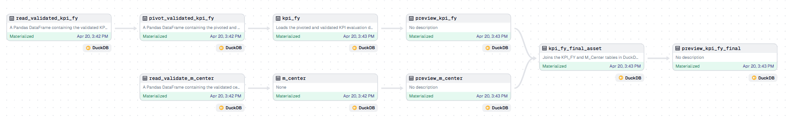
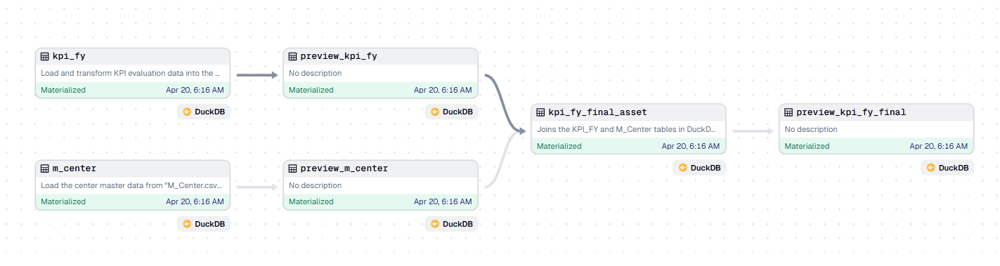

# Changelog

All notable changes to this project will be documented in this file.

## [1.1.0] - 2025-04-20

### Added
- Added final database file for KPI and master data storage.
- `column_condition` to explicitly declare SQL data types for each column during table creation.
- Added a validation flow to check data types and formats from files before loading into the database.

### Notes
- ✅ System is now ready for evaluation phase.
- This version includes extra-point questions.
  
### Screenshots v1.1.0
Here’s a preview of the application:

## [1.0.0] - 2025-04-20
### Added
- First version release of the project.
- Implemented core functionality to read data from Excel/CSV, transform and load it to DuckDB.
- Added logging functionality using Dagster logger.
- Supported data type casting for numeric columns and string for pre-processing (before SQL).
- Added a DataFrame preview in the Dagster UI for more convenient debugging and data validation.

### Fixed
- Addressed string to numeric conversion issues in data columns, ensuring that invalid strings (No) are coerced into NaN values.
- Fixed an issue where the database connection was not being properly closed after data load operations.

### Screenshots v1.0.0
Here’s a preview of the application:

### Notes
- This release includes all the necessary functionality for data extraction and loading.

